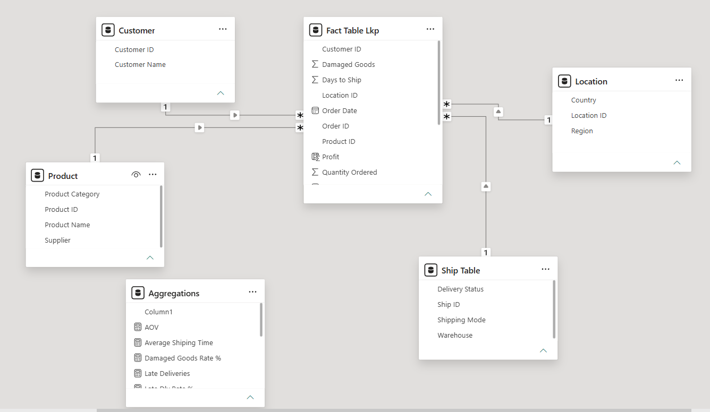
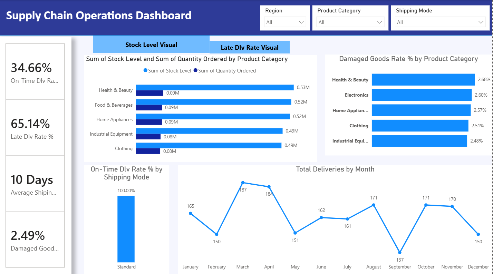
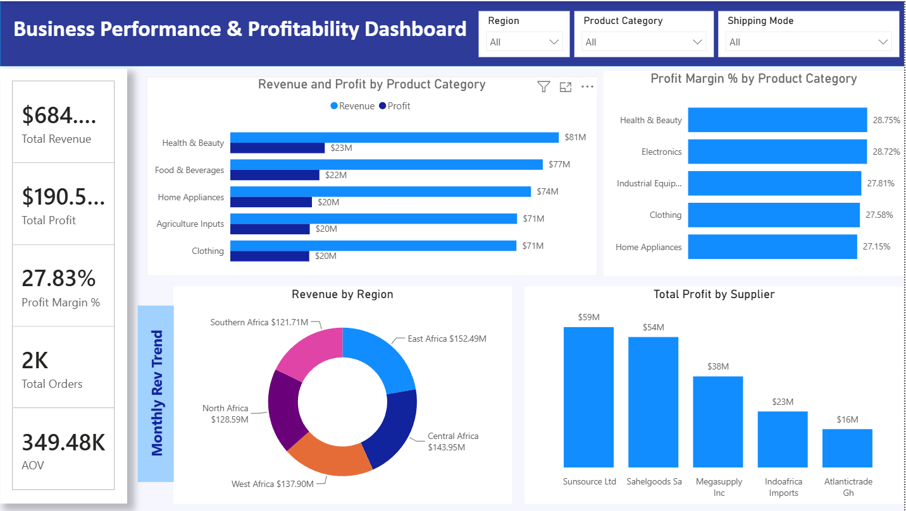
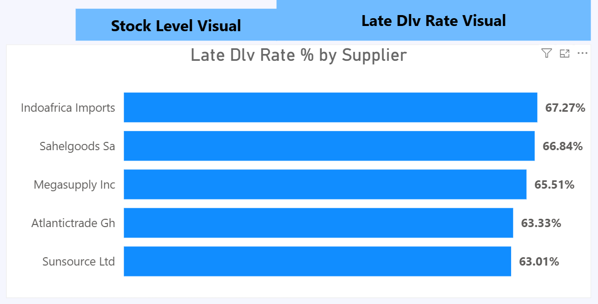
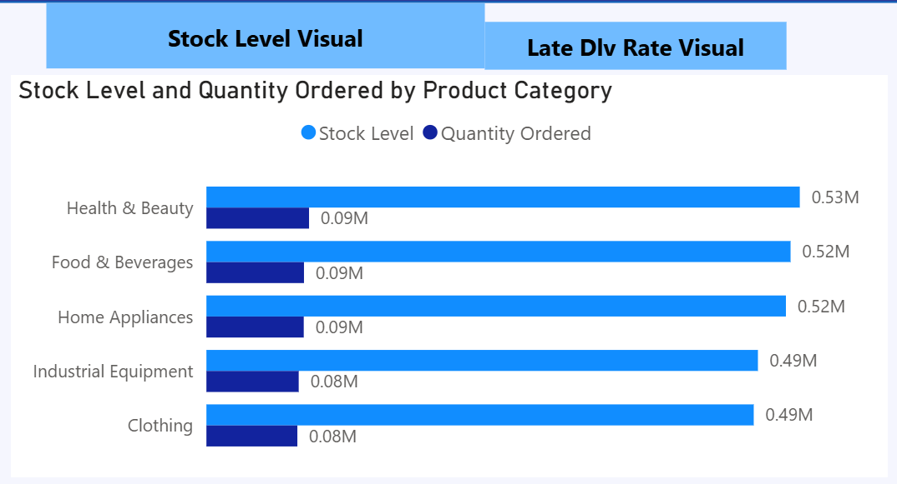
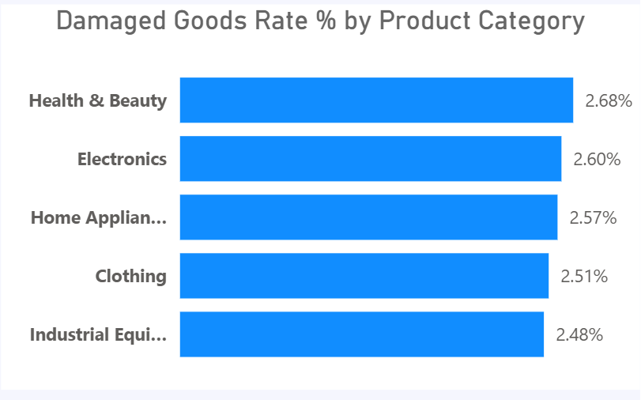
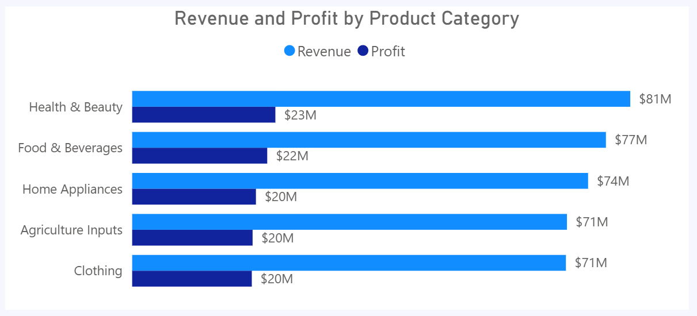
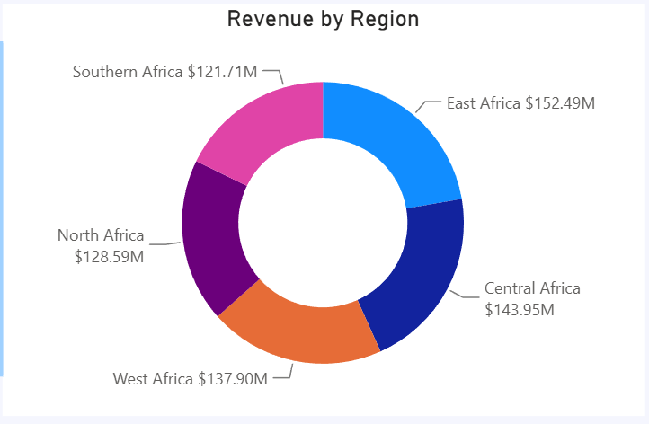

# 📦 GlobalMart Supply Chain Analytics

<div align="center">

# GlobalMart Supply Chain Analytics Dashboard

**End-to-End Business Intelligence Project using Excel, Power Query, Power BI & DAX**


</div>

---

# 📑 Table of Contents

- Project Overview
- Business Problem
- Objectives
- Dataset
- Data Cleaning
- Data Model
- Dashboard Preview
- KPIs
- Business Questions & Insights
- Recommendations
- Repository Structure
- Future Improvements
- Author

---

# 📖 Project Overview

GlobalMart operates across multiple African regions and manages suppliers, products, customers, inventory, and logistics. This project transforms raw operational data into an executive decision-support dashboard that helps stakeholders monitor delivery performance, profitability, supplier effectiveness, and inventory management.

---

# 🎯 Business Problem

The organization needed a centralized reporting solution to answer questions such as:

- Which suppliers are underperforming?
- Are deliveries arriving on time?
- Which product categories are most profitable?
- Are inventory levels aligned with customer demand?
- Which regions generate the highest revenue?
- Which product categories experience the highest damage rates?

---

# 🎯 Project Objectives

- Improve supply chain visibility.
- Evaluate supplier performance.
- Measure delivery efficiency.
- Analyze profitability.
- Optimize inventory decisions.
- Support strategic business decisions.

---

# 📂 Dataset

The dataset contains transactional supply chain records including:

- Orders
- Products
- Customers
- Suppliers
- Inventory
- Shipping
- Revenue
- Profit
- Regional information

---

# 🧹 Data Preparation (Power Query)

The dataset was cleaned entirely in Power Query.

✔ Removed duplicate records

✔ Standardized supplier names, regions and categories

✔ Corrected inconsistent text casing

✔ Converted mixed date formats

✔ Removed invalid values (`N/A`, `nil`, `--`, `?`)

✔ Handled missing values using business rules and lookup tables

✔ Validated data quality and consistency

---

# ⭐ Data Model

A **Star Schema** was implemented consisting of one Fact table linked to Product, Supplier, Customer, Date and Location dimensions.

> Replace with your Model View screenshot.




---

# 📊 Dashboard Preview

## Supply Chain Operations Dashboard





## Business Performance & Profitability Dashboard



---

# 📈 Key Performance Indicators

| KPI | Result |
|------|-------:|
| On-Time Delivery Rate | **34.66%** |
| Late Delivery Rate | **65.14%** |
| Average Shipping Time | **10 Days** |
| Damaged Goods Rate | **2.49%** |
| Total Revenue | **≈ $684M** |
| Total Profit | **≈ $190.5M** |
| Profit Margin | **27.83%** |
| Total Orders | **2K** |
| Average Order Value | **349.48K** |

---

# 💼 Business Questions & Insights

## 1️⃣ Which suppliers are underperforming?

```markdown

```

| Supplier | Late Delivery |
|-----------|--------------:|
| Indoafrica Imports | 67.27% |
| Sahelgoods SA | 66.84% |
| Megasupply Inc | 65.51% |
| Atlantictrade Gh | 63.33% |
| Sunsource Ltd | 63.01% |

**Business Insight**

Late delivery exceeds 63% for every major supplier shown, indicating widespread logistics issues rather than isolated supplier problems.

---

## 2️⃣ Are inventory levels aligned with demand?

```markdown

```

Inventory levels significantly exceed quantities ordered across all categories. Health & Beauty holds the largest inventory (0.53M) while customer demand remains around 0.09M, suggesting overstocking.

---

## 3️⃣ Which product categories experience the highest damage rates?

```markdown

```

| Category | Damage Rate |
|----------|------------:|
| Health & Beauty | 2.68% |
| Electronics | 2.60% |
| Home Appliances | 2.57% |

Damage rates remain below 3%, but targeted improvements in packaging and handling are recommended.

---

## 4️⃣ Which product categories generate the highest revenue?

```markdown

```

Health & Beauty leads with approximately **$81M** revenue and **$23M** profit, making it the strongest-performing category.

---

## 5️⃣ Which product categories deliver the highest margins?

```markdown

```

Health & Beauty records the highest profit margin (28.75%), closely followed by Electronics (28.72%).

---

## 6️⃣ Which regions contribute the most revenue?

```markdown

```

East Africa contributes the highest revenue share (22.27%), while revenue distribution across other regions remains balanced.

---

# 🎯 Strategic Recommendations

- Strengthen supplier performance monitoring through SLAs.
- Improve logistics planning to reduce late deliveries.
- Align inventory with actual demand forecasts.
- Enhance packaging for high-damage categories.
- Increase investment in high-margin product categories.
- Continue monitoring KPIs through Power BI dashboards.

---

# 📂 Repository Structure

```text
GlobalMart-Supply-Chain-Analytics/
│
├── Data/
├── Images/
├── PowerBI/
│   └── GlobalMart.pbix
├── Presentation/
│   └── Executive_Presentation.pptx
├── README.md
└── LICENSE
```

---

# 🚀 Future Improvements

- Demand forecasting
- Predictive inventory analytics
- Supplier scorecards
- Automated Power BI refresh
- Customer segmentation
- Executive mobile dashboard

---

# 👨‍💻 Author

**Fathiu Ligali**

Civil Engineering Graduate | Data Analyst

**Skills:** Power BI • Power Query • Excel • SQL • Python • DAX • Data Visualization

If you found this project useful, consider giving the repository a ⭐.
